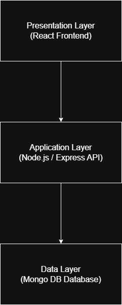

# System Architecture Overview

## System
Campus Cafeteria Pre-Order Web Application

## Architectural Style
Layered Architecture

## Description
The system is designed using a layered architecture to separate concerns between the user interface, business logic, and data storage. This improves maintainability, scalability, and team collaboration.

## Layers

- **Presentation Layer**: React web application used by students and cafeteria staff.
- **Application Layer**: Backend services (Node.js/Express) handling business logic such as order processing and time-slot management.
- **Data Layer**: Database (MongoDB) storing users, menu items, orders, and time slots.

## Alternative Options Considered

- **Monolithic Architecture**  
  Simpler to implement but becomes difficult to maintain and scale as the system grows.

- **Microservices Architecture**  
  Highly scalable but too complex for a small team and academic project.

## Trade-offs

- Layered architecture is easy to understand and implement.
- It supports separation of concerns and easier testing.
- Less scalable than microservices but sufficient for this project.

## Potential Architectural Issues

- Tight coupling between layers if not properly managed.
- Performance delays if communication between layers is inefficient.
- High number of users during peak hours may overload the backend.

## High-Level Architecture Diagram

