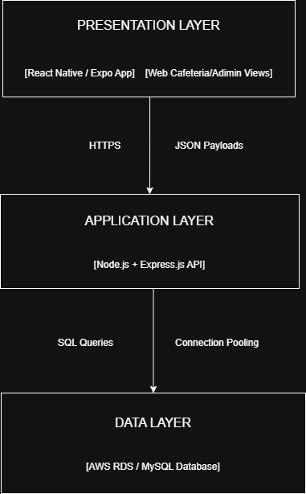

# System Architecture Overview

## System
UniBites is a mobile and web application designed using a three-tier architecture to completely separate the user interface, business logic, and database management for improved maintainability.

## Architectural Style Layered Architecture

The UniBites system utilizes a classic **3-Tier Layered Architecture** pattern. This framework enforces strict separation of concerns, ensuring that data requests travel sequentially down through isolated logical tiers, preventing cross-layer pollution and making full-stack debugging straightforward for our development team.

## Layers

- **Presentation Layer (Client-Side UI):** Uses React Native (Expo) for the mobile ordering app and responsive web components for admin/manager dashboards to render UI, manage local state, and exchange JSON payloads with the backend.

- **Application Layer (Business Logic Server):** Uses Node.js and Express.js to control backend routing, validate checkout schemas, orchestrate capacity-limited time-slot logic, and securely process data communications.

- **Data Layer (Relational Storage Systems):** Uses MySQL to manage persistent storage, enforce relational constraints, guarantee atomic transaction writes for orders, and execute queries for live catalog data.

## Alternative Options Considered

- **Monolithic Architecture**  
  While a monolithic approach is easier to deploy initially, coupling the frontend directly to server routines risks becoming unmaintainable and makes parallel feature development across our team highly chaotic.

- **Microservices Architecture**  
  Even though microservices offer excellent scalability and isolation, the operational complexity of managing API gateways, network latency, and distributed transactions is far outside our student team's timeline.

## Trade-offs

- Layered architecture is less scalable than microservices but sufficient for this project.
- Abandoned monolithic in favor of a layered tier system to guarantee modular team task distribution.
- Deferred SOA until future enterprise expansions.

## Potential Architectural Issues & Mitigation

- High transaction volumes during the campus lunch rush (12:00–13:00) could overwhelm the backend and slow down query responses.
Which can be solved using Node.js asynchronous, non-blocking I/O and configure MySQL database connection pooling to keep transaction throughput lightweight

- Developers might accidentally bypass architectural boundaries (e.g., frontend querying the database directly), creating fragile dependencies.
Can be mitigated by enforcing strict layer isolation where the presentation layer only communicates via REST APIs, and only the backend server can access the MySQL data cluster.

## High-Level Architecture Diagram

